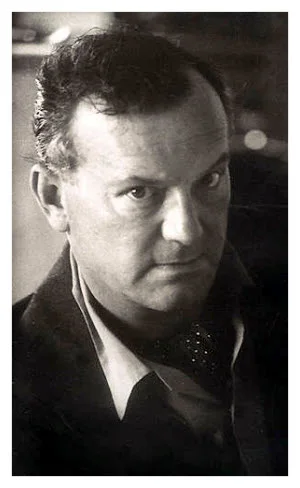

layout:true

  
  
Data in Design Thinking

  

    
    
      
      

--

class: center,middle

# Data in Design Thinking

- - -

## Facilitator: Richard Dunks

### Follow along at: 

#### See the code at: 

<strong><strong>Data in Design Thinking</strong></strong> by <a xmlns:cc="http://creativecommons.org/ns#" href="http://www.datapolitan.com" property="cc:attributionName" rel="cc:attributionURL">Richard Dunks</a> is licensed under a <a rel="license" href="http://creativecommons.org/licenses/by-sa/4.0/">Creative Commons Attribution-ShareAlike 4.0 International License</a>

---

class:center,middle
# Welcome

---
exclude:true

# [Zoom Drill](https://vimeo.com/407215417)
+ Mute and Unmute your microphone
+ Start and Stop your video
+ Post a message in the Chat window with your name and computer operating system (Windows or MacOS)
+ Click the Participants window and Raise your hand 

???
+ Facilitators will cover the following skills: muting themselves, stopping their video, typing in chat box, raising their hand, sharing their screen

---
exclude:true

# A Few Ground Rules
+ Step up, step back
+ One mic
+ Be curious and ask questions in the chat box
+ Assume noble regard and positive intent
+ Respect multiple perspectives 
+ Be present (phone, email, social media, etc.)

???
+ Facilitators establish the intention we have for the culture of the classroom

---
exclude:true
# Ground Rules

---

# On Our Titles
> Take the path of life in a way in which you do not allow yourself to be named in ways which are too small for yourself. 
>   
> David Whyte

???
> You don't give yourself too easy a defintion. You don't give those around you too easy a definition. You leave the mystery of where you are about to arrive to the actual physical sense of arrival and revelation itself.

---

# Introductions
--

+ Your Name
--

+ One thing resonating with you from Monday's session
--

+ 1 data point that has made an impact on your thinking (good or bad)

---

---

class:middle,center
# What is the Impact on Janice of Coming to School Hungry?

---

class:middle,center
# What Do We Do About It?

.caption[Author/Copyright holder: Teo Yu Siang and Interaction Design Foundation. Copyright terms and licence: [CC BY-NC-SA 3.0](https://creativecommons.org/licenses/by-nc-sa/3.0/)]

---

# Discerning Problems
--

--

+ Private Trouble
--

+ Public Issue
--

## How do we separate the two?
---

# What is Data?
--

+ Data is a collection of facts about something that's happened
--

+ Can be numbers, words, measurements, observations, or  descriptions
--

## Data can be anything and doesn't have to fit into a spreadsheet

---
# What is Data?
--

+ Can describe what happened either directly or indirectly
--

+ Example: morning food vending machine sales as a measurement of students coming to school hungry
--

## Know what your data is measuring

---

# The Limits of Data
--

> Empathy is not triggered by a statistic.  
> Krista Tippett
 

---

# Your Turn
--

+ We're going to put you into groups
--

+ Each group will be given a phase of design thinking
--

+ Consider data in that phase
--

+ Give us the high-level intent with data
--

+ Give us some examples of how data could be used with hunger in schools
--

+ Be ready to present to the group for discussion

---

class: center,middle
# Some Additional Thoughts

---

# Define

> The purpose of analysis is to bound uncertainty.
>   Dr. Mark Lowenthal

.caption[Source: [link](https://play.acast.com/s/spycast/intelligence-analysis-in-the-21st-century-an-interview-with-dr-mark-lowenthal)]

---

# Ideate

---

# Prototype

.caption[Photo by <a href="https://unsplash.com/@ryanmfranco?utm_source=unsplash&amp;utm_medium=referral&amp;utm_content=creditCopyText">Ryan Franco</a> on <a href="https://unsplash.com/s/photos/expression?utm_source=unsplash&amp;utm_medium=referral&amp;utm_content=creditCopyText">Unsplash</a>]

---

# Test

.caption[Photo by <a href="https://unsplash.com/@noguidebook?utm_source=unsplash&amp;utm_medium=referral&amp;utm_content=creditCopyText">Rachel</a> on <a href="https://unsplash.com/s/photos/clipboard?utm_source=unsplash&amp;utm_medium=referral&amp;utm_content=creditCopyText">Unsplash</a>]

---

exclude:true
# Value of Data

> Data is only as valuable as the decisions it enables
>    Ion Stoica

.caption[Source: [link](https://www.oreilly.com/radar/podcast/data-is-only-as-valuable-as-the-decisions-it-enables/)]

## If I knew `X` I could do `Y`

---
exclude:true
# Resources

---

# Final Thoughts

---

# Final Thoughts
> Numbers speak to our head, stories speak to our heart. When data tells a true and compelling story, we bring heart and head together in order to create action.

---

# Contact Information
+ [Email me](mailto:richard[at]datapolitan[dot]com)
+ Check out [my website](https://wwww.datapolitan.com)
+ Connect on [Twitter](https://twitter.com/Datapolitan)
+ Connect on [LinkedIn](https://www.linkedin.com/in/richarddunks/)
+ Follow us on [Instagram](https://www.instagram.com/datapolitan/)

---

class:middle,center
# Thank You!

